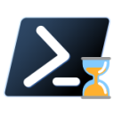

<div align="center">
   
   <h1>⌛ Measure-Time</h1>
   <p>A PowerShell module that exposes Measure-Time command to measure command execution time and cpu usage</p>

[](LICENSE.md)

[](https://img.shields.io/powershellgallery/v/Measure-Time?label=PowerShell%20Gallery%20Version)
[](https://github.com/abdalmoniem/Measure-Time/releases/latest?label=GitHub%20Release%20Version)

[](https://github.com/abdalmoniem/Measure-Time)
[](https://github.com/abdalmoniem/Measure-Time/releases/latest?label=GitHub%20Downloads)
[](https://img.shields.io/powershellgallery/dt/Measure-Time?label=PowerShell%20Gallery%20downloads)

</div>

# 🎯 Overview

**Measure-Time** is a PowerShell module that goes beyond the built-in `Measure-Command` cmdlet by providing rich execution diagnostics — including elapsed wall-clock time **and** CPU usage statistics — all in a single, easy-to-use command. It wraps a lightweight C# helper library (`JobApiLib`) that interfaces with the Windows Job Object API to collect accurate per-process CPU metrics, giving you a complete picture of how expensive any command or script block truly is.

---

# ✨ Features

- ⏱️ **Elapsed time measurement** — reports `total wall-clock time` for any script block or command
- 🖥️ **CPU usage tracking** — captures `user-mode` and `kernel-mode` CPU time via the Windows Job Object API
- 📊 **Clean, readable output** — presents results in a formatted summary table directly in the console
- 🧩 **Drop-in simplicity** — works just like `Measure-Command`; wrap any script block and go
- 🪟 **Windows support** — compatible with `Windows PowerShell 5.1` and `PowerShell 7+`

---

# 📥 Installation

### From the PowerShell Gallery

```powershell
Install-Module -Name Measure-Time -Scope CurrentUser
```

### From GitHub Releases

Download the latest `.zip` from the [Releases page](https://github.com/abdalmoniem/Measure-Time/releases/latest), extract it, and copy the `Measure-Time` folder to one of your `$env:PSModulePath` directories, for example:

```powershell
# PowerShell 7+ (current user)
$psModPath = "$HOME\Documents\PowerShell\Modules\Measure-Time"

# Windows PowerShell 5.1 (current user)
$psModPath = "$HOME\Documents\WindowsPowerShell\Modules\Measure-Time"

Copy-Item -Recurse .\Measure-Time -Destination $psModPath
```

Then import the module:

```powershell
Import-Module Measure-Time
```

---

# 🚀 Usage

### Basic usage

```powershell
Measure-Time { Get-ChildItem C:\Windows -Recurse }
```

### Measuring a command string

```powershell
Measure-Time { Start-Sleep -Seconds 3 }
```

### Example output

```powershell
PS> Measure-Time { cat -raw .\logcat.log | pidcat -SIPp }
...
{ cat -raw .\logcat.log | pidcat -SIPp }  02s 234ms user 01s 500ms system 53% cpu 07s 74ms total
```

### Getting help

```powershell
Get-Help Measure-Time -Full
```

---

# 🔨 Building from Source

- ## Prerequisites

  - [PowerShell 7+](https://github.com/PowerShell/PowerShell/releases) or `Windows PowerShell 5.1`
  - [.NET SDK 8.0+](https://dotnet.microsoft.com/download) - for building the `JobApiLib` C# component
  - [just](https://github.com/casey/just) — a command runner used to automate build tasks

- ## Build Steps

  - Clone the repository:
     ```powershell
     git clone git@github.com:abdalmoniem/Measure-Time.git
     cd Measure-Time
     ```

  - List available build tasks:
     ```powershell
     just
     ```

  - Build the full module (compiles `JobApiLib` and assembles the PowerShell module):
     ```powershell
     just create-module
     ```

  - The assembled module will be output to the `Measure-Time` directory, ready to import or publish.

  - Test locally:
    ```powershell
      Import-Module -Force .\Measure-Time\Measure-Time.psd

      Measure-Time { Start-Sleep 3 }
      Measure-Time { 0..500000 | ForEach-Object { $_ = $_ * $_ } }
    ```
---

# 🤝 Contributing

Contributions are welcome! Here's how you can help:

- ## Fork the Repository
  ```powershell
  git clone git@github.com:abdalmoniem/Measure-Time.git
  ```

- ## Create a Feature Branch
  ```powershell
  git checkout -b feature/amazing-feature
  ```

- ## Commit Your Changes
  ```powershell
  git commit -m 'Add some amazing feature'
  ```

- ## Push to the Branch
  ```powershell
  git push origin feature/amazing-feature
  ```
- ## Open a Pull Request

- ## Development Guidelines

  - Follow the [PowerShell Best Practices and Style Guide](https://poshcode.gitbook.io/powershell-practice-and-style)
  - Follow C# coding conventions for any changes to `JobApiLib`
  - Add comment-based help (`Get-Help`) for all exported functions
  - Test on both Windows `PowerShell 5.1` and `PowerShell 7+`
  - Test on `Windows 10` and `Windows 11`
  - Update documentation and changelog for new features

---

# 📄 License

This project is licensed under the `GNU General Public License 3.0` - see the [LICENSE](LICENSE.md) file for details.

---

<div align="center">

**Made with ❤️ for PowerShell Users**

If you find Measure-Time useful, please ⭐ star the repository!

</div>
